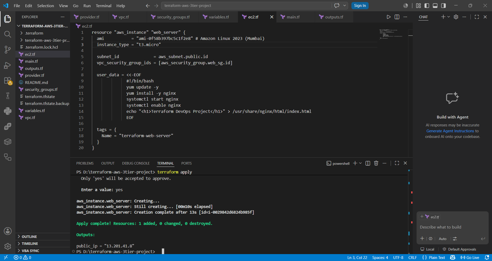
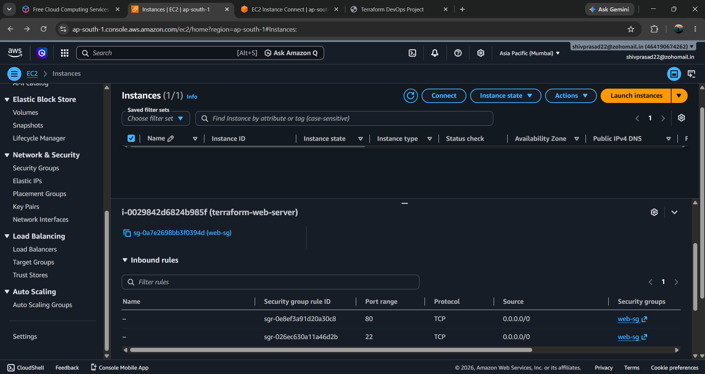
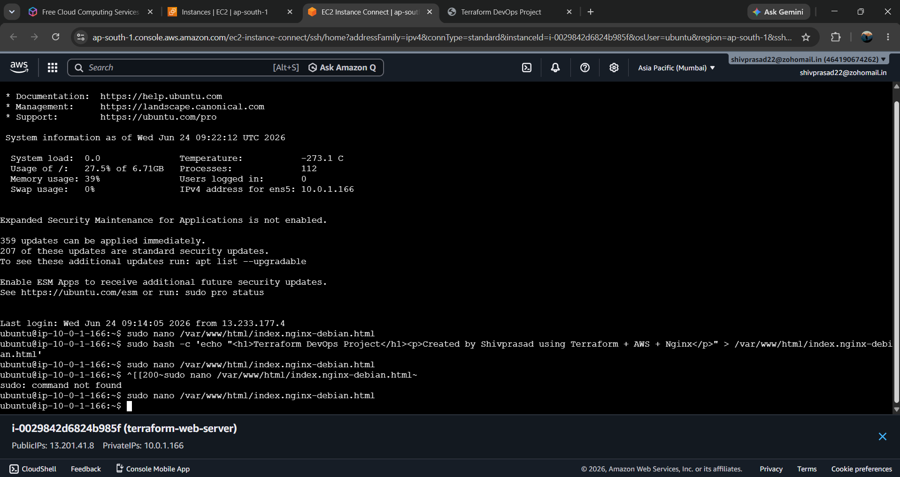
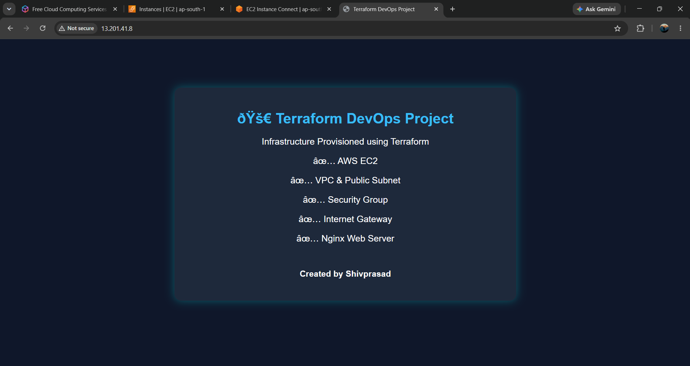

# Terraform AWS Web Server Project

## Project Overview

This project demonstrates Infrastructure as Code (IaC) using Terraform to automatically provision AWS resources and deploy an Nginx web server on an EC2 instance.

The infrastructure is fully managed through Terraform configuration files.

## Architecture

AWS Cloud
├── VPC
├── Public Subnet
├── Internet Gateway
├── Route Table
├── Security Group
└── EC2 Instance (Nginx Web Server)

## Technologies Used

- Terraform
- AWS EC2
- AWS VPC
- Security Groups
- Internet Gateway
- Nginx
- Git & GitHub

## Resources Created

- VPC
- Public Subnet
- Internet Gateway
- Route Table
- Security Group
- EC2 Instance
- Nginx Web Server

## Features

- Infrastructure as Code (IaC)
- Automated AWS Resource Provisioning
- Automated EC2 Deployment
- Automated Nginx Installation
- Public Web Server Access
- Terraform State Management

## Deployment Steps

### Initialize Terraform

```bash
terraform init
```

### Validate Configuration

```bash
terraform validate
```

### Preview Infrastructure

```bash
terraform plan
```

### Deploy Infrastructure

```bash
terraform apply
```

### Destroy Infrastructure

```bash
terraform destroy
```

## Project Screenshots

### Terraform Apply Success


### EC2 Instance Running


### Security Group Configuration


### EC2 Instance Connect


### Nginx Web Server


---

## Project Outcome

Successfully provisioned AWS infrastructure using Terraform and deployed a publicly accessible Nginx web server.

### Components Created
- AWS EC2 Instance
- Custom VPC
- Public Subnet
- Internet Gateway
- Security Group
- Nginx Web Server

---

## Author

**Shivaprasad Naik**  
MCA Graduate | AWS & DevOps Learner
